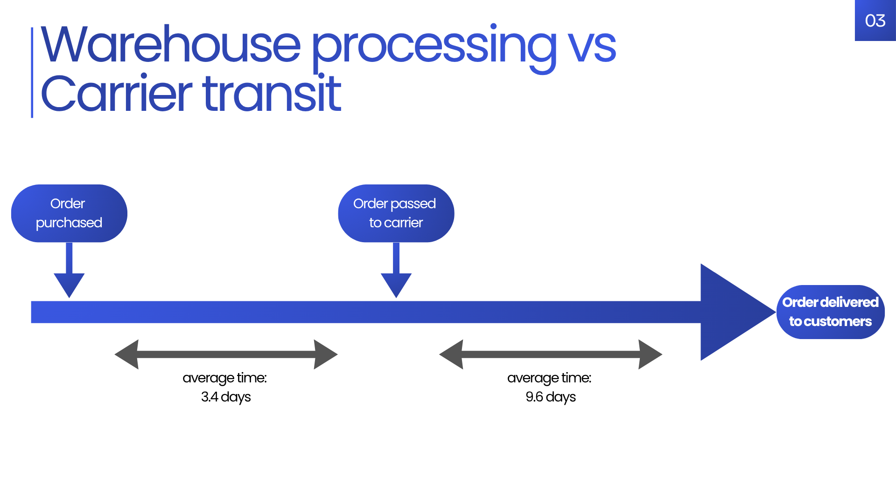

# Strategic Market Entry Analysis: Scaling High-End Tech in the Magist Ecosystem

📋 **Project Overview**
Eniac, a premium tech manufacturer, is considering a strategic expansion into the Brazilian market via the Magist marketplace. This project evaluates the partnership's viability by analyzing three years of transactional data to identify market demand and potential logistics risks. By isolating "Tech" categories and analyzing fulfillment lifecycles, I provided a data-driven recommendation on whether Magist’s infrastructure can support a high-end brand's reputation and is the right choice for Eniac to move forward with.

📊 **Dataset & Sources**
Source: Provided via a MySQL Database Dump (.sql) from WBS coding school.

Size: ~100,000 orders spanning 2016 to 2018.

Key Features: order_purchase_timestamp, order_delivered_carrier_date, order_delivered_customer_date, product_category_name_english, price, and order_status.

Preprocessing: Filtered specifically for delivered orders within 2017–2018 and mapped 70+ categories into a specialized "Tech" segment. 
The project involved a full database restoration from the dump file. Data was cleaned to handle null delivery timestamps and to join Portuguese-to-English category translations for standardized reporting.

🚀 **Key Findings & Results**
- The "big fish" opportunity: Despite good traffic, a gap exists in the tech sector; only one seller currently exceeds €8k/month in revenue. Eniac has a chance to open the gate for high-end products to an yet untapped market.

- <u>Demand growth</u>: The "tech" category saw a 42% YoY growth from 2017 to 2018, signaling a maturing tech audience within the Brazilian market.
*Tech categories includes 'audio','electronics','computers_accessories','computers','telephony'*

- <u>Delayed delivery processings</u>: While carrier speeds are 'stable' but slow, internal warehouse processing times for tech products increased in 2018 as volume scaled, posing a risk to Eniac's delivery standards.

- <u>Accuracy Risk</u>: Qualitative review analysis identified recurring "Wrong Product Delivered" complaints, low customer support, long delays. A clash against what Eniac sees as its unique selling point.

🛠️ **Technologies Used**
--> <u>Database</u>: MySQL
--> <u>Visualization</u>: Tableau
--> <u>Communication</u>: Canva

📁**Project Structure**

* Handling time from both Magist and Carrier is inefficient

* No real competitor playing in Eniac's field

**Challenges Overcame**: Too much information was provided about the content chosen.
--> After receiving feedbacks, changes were made for a leaner and more impactful presentation.

**Final recommendations:**
## To move forward with Magist, Eniac is requesting those conditions:
-_Premium delivery service option_

-_Dedicated premium customer support_

-_Dedicated tech-handling team for our product or double check protocol_

**Additional Reflections**: An absence of competitors is not just an opportunity; it is a signal. While Eniac could be a "First Mover," we must acknowledge that a vacuum often exists because the operational environment (logistics and infrastructure) is not yet mature enough to support high-end tech.
Logistics isn't just a back-end cost, it is part of the product but also the identity of the company.

